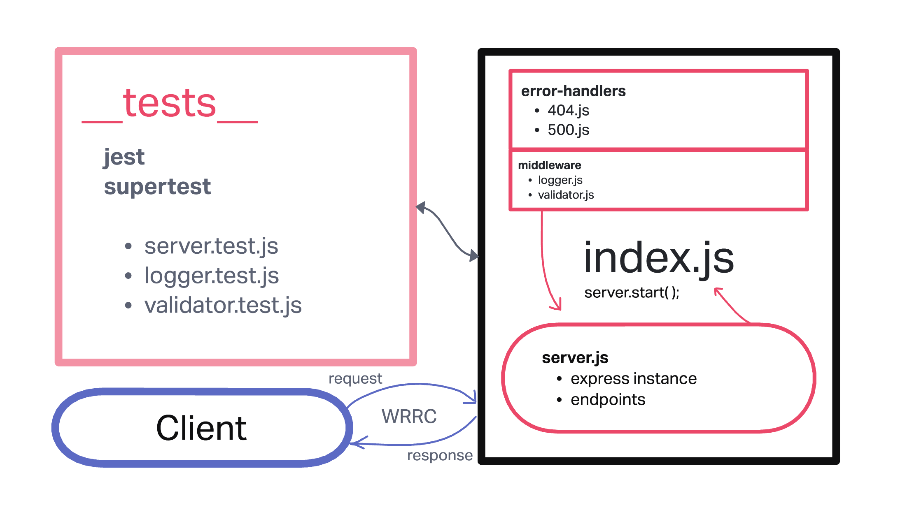

# LAB - Class 02

## Project: Basic Express Server and Testing

### Author: Dustin Apodaca

### Problem Domain

- To build a basic Express server using best practices, including server modularization, use of middleware, and tests.

### Links and Resources

- [CI/CD](https://github.com/dustinapodaca/basic-express-server/actions) (GitHub Actions)
- [Prod Deployment](https://basic-express-server-prod.onrender.com)
- [Dev Deployment](https://basic-express-server-4wjg.onrender.com)

### Setup

#### `.env` requirements (where applicable)

see `.env.sample`

- `PORT` - 3002

#### How to initialize/run your application (where applicable)

- nodemon

#### Features / Routes

- Feature One: Deploy to Dev
- GET : `/` - specific route to hit
- GET : `/person` - query route to hit
- Feature Two: Testing
- Feature Three: Deploy to Dev
- Feature Four: Deploy to Prod

#### Tests

- How do you run tests?
  - npm test
- Any tests of note?
  - 404 on a bad route
  - 404 on a bad method
  - 500 if no name in the query string
  - 200 if the name is in the query string
  - given a name in the query string, the output object is correct

#### UML

Link to an image of the UML for your application and response to events

